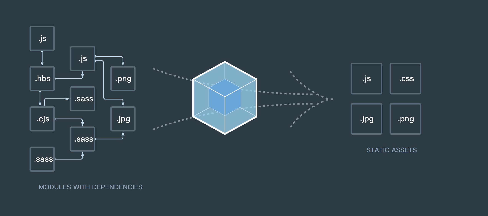

## Webpack 概述

A bundler for javascript and friends. Packs many modules into a few bundled assets. Code Splitting allows to load parts for the application on demand. Through "loaders," modules can be CommonJs, AMD, ES6 modules, CSS, Images, JSON, Coffeescript, LESS, ... and your custom stuff.





## 版本迭代

[官方更新情况](https://github.com/webpack/webpack/releases)

**大版本变化**

1. Webpack v1.0.0 --- 2014.2.20
2. Webpack v2.2.0 --- 2017.1.18
3. Webpack v3.0.0 --- 2017.6.19
4. Webpack v4.0.0 --- 20182.25
5. 目前还在对4版本不断更新

## 功能演进

**Webpack V1**

* 编译、打包
* HMR（模块热更新）
* 代码分割
* 文件处理

**Webpack V2**

* Tree Shaking (将没有使用的代码，全部除去)
* ES module （不依赖三方）
* 动态 Import()  (函数)
    * 懒加载，打包后文件名是不知道的
* 新的官方文档

**Webpack V3**

* Scope Hoisting （作用域提升）
* Magic Comments （配合动态import使用）

    * 打包可以指定懒加载的 chunk 文件名

## 版本迁移

[迁移指南](https://webpack.js.org/migrate/)

[迁移指南 - 中文](https://doc.webpack-china.org/guides/migrating/)

## 核心概念

1. Entry
2. Output   
3. Loaders
4. plugins  

### Entry

* 代码入口
* 打包的入口
* 单个或多个

```
module.exports = {
    entry: 'index.js',
    // or
    entry: ['index.js', 'vender.js']
    // or 推荐
    entry: {
        index: 'index.js',
        vender: 'vender.js',
        lib: ['util.js', 'fetch.js']
    }
};
```

推荐使用键值对的形式来书写我们要打包的文件，清晰、直观、写法优美；可以通过key 寻找到指定的 value
### Output

* 打包生成的文件（bundle）
* 一个或多个文件
* 自定义规则，来生成指定的文件名

```
module.exports =  {
    entry: 'index.js',
    output: {
        filename: 'index.bundle.js'
    }
    // or
    entry: {
        index: 'index.js',
        vender: 'vender.js'
    },
    output: {
        // name => index\vender  hash:5 => 唯一标示码
        filename: [name].bundle.[hash:5].js'
    }
}
```

### Loaders

* 处理文件
* 转化为模块，eg: 在js 文件里引入 css 文件来；通过css-loader 转化我们可识别可运行的代码快

**常用Loader**

* 编译相关
    * babel-loader 、ts-loader...
* 样式相关
    * style-loader、css-loader、 less-loader、postcss-loader...
* 文件相关
    * file-loader、 url-loader...

```
module.exports = {
    module: {
        rules: [
            {
                test: /\.css$/,
                use: 'css-loader'
            }
        ]
    }
}
```

### Plugins

* 参与打包的整个过程
* 打包优化和压缩
* 配置编译时的变量
* 极其灵活

```
const webpack = require('webpack')

module.exports = {
    plugins: [
        // 混淆压缩代码
        new webpack.optimize.UglifyJsPlugin()
    ]
} 
```

**常用Plugins**

* 优化相关
    * CommonsChunkPlugin 从不同的 Chunk 中提取公共的Chunk
    * UglifyjsWebpackPlugin 混淆压缩代码，还支持 sourceMap
* 功能相关
    * ExtractTextWebpackPlugin 提取css 成单独的文件
    * HtmlWebpackPlugin 生成Html文件
    * HotModuleReplacementPlugin 模块热更新
    * CopyWebpackPlugin  copy文件


## 名词

1. Chunk （块，代码块）
2. Bundle  (打包好)
3. Module （模块）

