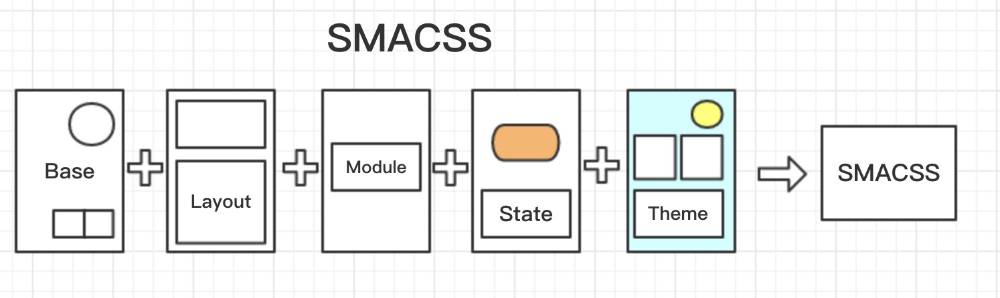

# 模块化

模块化是指解决一个复杂问题时自顶向下逐层把系统划分成若干模块的过程，有多种属性，分别反映其内部特性。

我们拿下图的 谷歌Project Ara模块化手机 为例，直观的了解什么是模块化。一部手机是由各个不同功能的模块进行组装而成。


## JS 模块化

**模块化发展**

* 命名空间
* CommonJS规范（服务端）
* AMD/CMD/UMD 规范
* ES6 module 规范
### 命名空间

刚刚开始产生模块化思想的时候，是以命名空间规范来达到模块化

* 库名.类别名.方法名

```
var NameSpace = {}

NameSpace.type = NameSpace.type || {}
NameSpace.type.method = function () {}

```
以这种命名空间的形式来达到模块化，有很多的弊端，必须要知道完整的路径；团队开发时必须提前先声明定义好各自的命名空间，以防止覆盖；覆盖了也很难检测出问题

### CommonJS

首先你需要知道：
1. CommonJS 是一套规范
2. CommonJS 是为了解决 JavaScript 的作用域问题而定义的模块形式，可以使每个模块它自身的命名空间中执行。
3. CommonJS 是以在浏览器环境之外构建 JavaScript 生态系统为目标而产生的项目，比如在服务器和桌面环境中。

其次，CommonJS 模块化规范的几个准则：
* 一个文件为一个模块
* 通过 `module.exports` 暴露模块接口
* 通过 `require` 引入模块
* 运行在服务端，是同步加载

``` 
# math.js 暴露模块
function add () {
    var sum = 0, i = 0, args = arguments, l = args.length;
    while (i < l) {
        sum += args[i++];
    }
    return sum;
};
module.exports = aa;

# 引入模块
var math = require('math');
math.add();

var add = require('math').add;

var { add } = require('math');

```

> [文档](http://wiki.commonjs.org/wiki/Modules/1.1.1)

### AMD (Asynchronous Module Definition)

异步模块定义规范（AMD）制定了定义模块的规则，这样模块和模块的依赖可以被异步加载。这和浏览器的异步加载模块的环境刚好适应（浏览器同步加载模块会导致性能、可用性、调试和跨域访问等问题）。

* 使用 `define` 定义模块
* 使用 `require` 加载模块
* 特点： 依赖前置，提前加载（但是是异步，不会影响html和css 的加载）
* 常用的库： RequireJS

```
define(
    // 模块名 （可选）
    "alpha", 
    // 依赖 （可选）
    ["require", "exports", "beta"],
    // 模块输出
    function (require, exports, beta) {
        exports.verb = function() {
            return beta.verb();
            //Or:
            return require("beta").verb();
        }
    }
);

define(function(require) {
    var $ = require('jquery');
    $('body').text('hello world');
});

```
> [文档](https://github.com/amdjs/amdjs-api/wiki/AMD-(%E4%B8%AD%E6%96%87%E7%89%88))

### CMD （Common Module Definition）

* 一个文件为一个模块
* 使用 `define` 来定义一个模块
* 使用 `require` 来加载一个模块
* 特点：懒加载执行 (require 进来，文件下载了，但并不会去执行，需要直到运行到调用的地方才会去执行)

```
// 定义模块
define(function(require, exports, module) {
  // 引入模块
  var math = require('./math');

  // 对外提供模块
  exports.add = function() {
    var sum = 0, i = 0, args = arguments, l = args.length;
    while (i < l) {
      sum += args[i++];
    }
    return sum;
  };

  // 或者 通过 module.exports 提供接口
  module.exports = {}

});


```
> [文档](https://github.com/cmdjs/specification/blob/master/draft/module.md)

### UMD （Universal Module Definition）

UMD模式通常会尝试提供当前最流行的脚本加载器（例如RequireJS等）的兼容性。在很多情况下，它使用AMD作为基础，并添加了特殊外壳来处理CommonJS兼容性。

* 通用模块解决方案
* 三个步骤
    * 判断是否支持 AMD
    * 判断是否支持 CommonJS
    * 都不支持，定义为全局变量


```
(function (root, factory) {
    if (typeof define === 'function' && define.amd) {
        // AMD. Register as an anonymous module.
        define(['b'], factory);
    } else if (typeof module === 'object' && module.exports) {
        // Node. Does not work with strict CommonJS, but
        // only CommonJS-like environments that support module.exports,
        // like Node.
        module.exports = factory(require('b'));
    } else {
        // Browser globals (root is window)
        root.returnExports = factory(root.b);
    }
}(typeof self !== 'undefined' ? self : this, function (b) {
    // Use b in some fashion.
    // Just return a value to define the module export.
    // This example returns an object, but the module
    // can return a function as the exported value.
    return {};
}));
```

> [文档](https://github.com/umdjs/umd)

### ESM (ECMAScript Module)

* ES6 提出
* 一个文件一个模块
* export / import 暴露接口/引入接口

```
# 引入 import
import { stat, exists, readFile } from 'fs';
import stat from './stat';
// 引入时重命名
import stat as start from './stat';
// 将mylib模块导出的方法全部引入到 mylib 中
import  * as mylib from './mylib';


# 导出 export
var firstName = 'Michael';
var lastName = 'Jackson';
var year = 1958;

export {firstName, lastName, year};

export function multiply(x, y) {
  return x * y;
};

// 写法一
export var m = 1;

// 写法二
var m = 1;
export {m};

// 写法三
var n = 1;
export {n as m};

export class myClass {}

export default 123;

export default funtion (x) {
    return x * 2;
};

```

## Css 模块化

Css 模块化，说的更多是Css设计模式。

有哪几种呢？

* OOCSS
* SMACSS
* Atomic CSS
* MCSS
* AMCSS
* BEM
* CSS Modules

### OOCSS（Object Oriented CSS）

OOCSS 字面意思就是面向对象的CSS，其主要有两个原则：

1. Separate structure and skin（分离结构和主题）
2. Separate container and content（分离容器和内容）

用一个例子来说明。请看下面这样的图文排列：


```
<div class="media media-shadow">
    <div class="media-image-container">
        
    </div>
    <div class="media-body">
        <p class="media-text">本作的主角，帝国北部地方贵族施瓦泽男爵的养子，也是托尔兹士官学校特科班“Ⅶ组”的成员。</p>
    </div>
</div>
```

```
.media{
    padding: 10px;
}
.media:after{
    display: table;
    clear: both;
    content: " ";
}
.media-image-container{
    float: left;
    margin-right: 10px;
}
.media-image{
    display: block;
}
.media-body{
    overflow: hidden;
}
.media-shadow{
    box-shadow: 1px 1px 3px rgba(0, 0, 0, .5);
}
```

上面这段代码用media表示了这种图文排列的页面元素。如果把构成它的html、css及javascript（如果有）看做一个整体，那就相当于这是一个元件，或者说对象（object）。它可以在站点的任何地方被重用。

**这样是如何体现OOCSS的两个原则的呢？**

**Separate structure and skin**

分离结构和主题是在于将一些视觉样式效果（例如background、color）作为单独的“主题”来应用。在上面的例子中的阴影效果，没有被直接写在media的样式规则内，而是被单独写在了一个名为media-shadow的class中。因此，它成为了可选择、可拆分的主题。如果不需要对应主题，什么也不要加，如果需要，加上对应的class，就是这样的思路。

**Separate container and content**

分离容器和内容要求使页面元素不依赖于其所处位置。在上面的例子中，css的选择符都很短，无继承选择符（例如.header .media { }），所以，这个图文排列的元件，可以在任何地方使用，且会有一致的外观。

如果需要在特定的地方让这个元件看起来不一样一些，继续为这个元件增加class，将“不一样的部分”作为可配置的选项。元件的外观仍不依赖其所处位置。

**操作指南**

可以看出，OOCSS风格的css可以描述为两点：

* 增加class
* 不使用继承选择符

OOCSS追求元件的复用，其class命名比较抽象，一般不体现具体内容。

> 本示例摘抄自 [segmentfault](https://segmentfault.com/a/1190000000704006)
### SMACSS 

SMACSS提出的css理论。其主要原则有3条：

1. Categorizing CSS Rules（为css分类）
2. Naming Rules（命名规则）
3. Minimizing the Depth of Applicability（最小化适配深度）

**Categorizing CSS Rules**

这一点是SMACSS的核心。SMACSS认为css有5个类别，分别是：



* Base
* Layout（Major Components）
* Module（Minor Components）
* State
* Theme

Base Rules， 基础样式，描述的是任何场合下，页面元素的默认外观。它的定义不会用到class和ID。css reset也属于此类。

**Layout Rules**， 布局样式。它和后面的Module Rules一同，描述的是页面中的各类具体元素。元素是有层次级别之分的，Layout Rules属于较高的一层，它可以作为层级较低的Module Rules元素的容器。左右分栏、栅格系统等都属于布局样式。

**Module Rules**， 模块样式。它可以是一个产品列表，一个导航条。一般来说，Module Rules定义的元素放置于前面说的Layout Rules元素之内。模块是独立的，可以在各种场合重用。

**State Rules**， 状态样式，描述的是任一元素在特定状态下的外观。例如，一个消息框可能有success和error两种状态，导航条中的任一项都可能有current状态。

继续OOCSS中的例子，下面新增的让元素不显示的is-hidden就属于State Rules：

```
# html
<div class="media media-shadow is-hidden">
    ...
</div>

# css
.is-hidden{
    display: none;
}
```

**Theme Rules**， 主题样式，描述了页面主题外观，一般是指颜色、背景图。Theme Rules可以修改前面4个类别的样式，且应和前面4个类别分离开来（便于切换，也就是“换肤”）。SMACSS的Theme Rules不要求使用单独的class命名，也就是说，你可以在Module Rules中定义.mod { }然后在Theme Rules中也用.mod { }来定义需要修改的部分。

**Naming Rules**

Naming Rules是说在想class等的命名时，考虑用命名体现样式对应的类别。

按照前面5种的划分，`Layout Rules`用`l-`或`layout-`这样的前缀，例如：`.l-header`、`.l-sidebar`。

`Module Rules`用模块本身的命名，例如图文排列的`.media`、`.media-image`。

`State Rules`用`is-`前缀，例如：`.is-active`、`.is-hidden`。

`Theme Rules`如果作为单独`class`，用`theme-`前缀，例如`.theme-a-background`、`.theme-a-shadow`。

`Base Rules`不会用到`class`和`ID`，是以标签选择符为主的样式，例如`p`、`a`，无需命名。

命名规则不需要严格遵守，可以根据实际情况和自身喜好做其他的约定。记录自己的约定（写文档），然后遵守，就是可行的。

**Minimizing the Depth of Applicability**

字面翻译是最小化适配深度。通过一个简单的描述来说明：

```
/* depth 1 */
.sidebar ul h3 { }

/* depth 2 */
.sub-title { }
```

上下两端css的区别在于html和css的耦合度。可以想到，由于上面的样式规则使用了继承选择符，因此对于html的结构实际是有一定依赖的。如果把h3元素搬到另一个位置，就有可能不再具有这些样式。对应的，下面的样式规则只有一个选择符，因此不依赖于特定html结构，只要为元素添加class，就可以获得对应样式。

当然，继承选择符是有用的，它可以减少因相同命名引发的样式冲突（常发生于多人协作开发）。但是，我们不应过度使用，在不造成样式冲突的允许范围之内，尽可能使用短的、不限定html结构的选择符。这就是SMACSS的最小化适配深度的意义。

看起来，这一点和OOCSS的分离容器和内容的原则非常相似。

**主要目标**

SMACSS着力于实现两个主要目标：

* 更语义化的html和css
* 降低对特定html结构的依赖

### Atomic Css (原子级的css)

原子CSS与内联样式一样，提供单一样式的单元，但通过类应用。每一个class都有自己的单一样式。

```
<div class="Row">
    <div class="w-100 h-15 Bgc(#0280ae):h"></div>
</div>

// w width
// h height
// Bgc Background-color
// :h 将鼠标悬停时的hover
```

### MCss （Multilayer CSS）

多层级CSS

MCSS 的理论是非常灵活的并且不需要强制使用特定的编码风格, 文件系统组织或者特定的工具才能工作.最主要的就是分割规则到不同的块. CSS 模块(和其中的组建) 被分割成不同的层, 每个层都有自己的规则去利用和交互别的层.

[文档](http://operatino.github.io/MCSS/cn/)

### BEM 

BEM通过Block、Element、Modifier来描述页面。

* `Block`是页面中独立存在的区块，可以在不同场合下被重用。每个页面都可以看做是多个`Block`组成。
* `Element`是构成`Block`的元素，只有在对应`Block`内部才具有意义，是依赖于`Block`的存在。
* `Modifier`是描述`Block`或`Element`的属性或状态。同一`Block`或`Element`可以有多个`Modifier`。

这三部分结合在一起，可以体现在class命名上，从而为开发者提供更友好、更有意义的css组织方式。其形式是：

```
.block { }
.block_modifier { }
.block__element { }
.block__element_modifier { }
```
再回到前面OOCSS的那个图文排列的例子，对应用BEM的写法的话就是：

```
<div class="media media_shadow">
    <div class="media__image-container">
        
    </div>
    <div class="media__body">
        <p class="media__text">本作的主角，帝国北部地方贵族施瓦泽男爵的养子，也是托尔兹士官学校特科班“Ⅶ组”的成员。</p>
    </div>
</div>
```
这样的写法的好处是，在class命名上以约定的形式携带了更多有用信息。在多人合作的时候，新接手这个项目的人，也可以很容易从class命名上分辨出来，哪些部分是Block，哪些是对应的Element，哪些是Modifier，并进一步推断出哪部分html可以独立使用。

BEM是完整的前端开发理论，这里只是提到了它采用的css的class命名规则。可以看出，BEM的命名规则可以使代码更易于维护。

